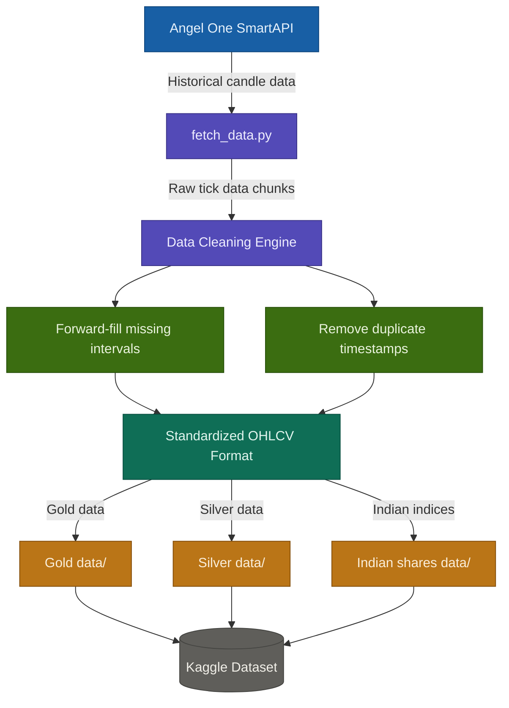

# 📈 Financial Data Pipeline: MCX Commodities & Indian Indices (OHLCV)

This repository contains a robust **Python-based ETL (Extract, Transform, Load) pipeline** designed to fetch, clean, and structure high-frequency historical data for the Indian Market (**MCX & NSE**). 

The goal of this project is to provide "Analysis-Ready" datasets for algorithmic trading backtesting, quantitative research, and market analysis.

---

## 💎 Assets Covered
* **Commodities (MCX):** Gold & Silver (1-Minute Interval).
* **Indices (NSE):** Nifty 50, Bank Nifty, and FinNifty (1-Minute Interval).
* **Time Period:** October 2024 – February 2026.

---

## 🚀 Key Features
* **Automated Extraction:** Seamless integration with **Angel One SmartAPI** to programmatically fetch historical candle data.
* **Advanced Data Cleaning:**
    * **Time-Series Continuity:** Handled missing intervals using **Forward-Fill (ffill)** logic.
    * **Deduplication:** Automated removal of duplicate timestamps and handled data overlaps during chunked processing.
* **Standardized Output:** All data is exported in standardized **OHLCV** (Open, High, Low, Close, Volume) format.
* **Memory Optimized:** Engineered to handle large data chunks efficiently, ensuring a low memory footprint even with GBs of data.

---

## 🛠️ Tech Stack
* **Language:** 
* **Libraries:** `Pandas`, `NumPy`, `Requests`, `Datetime`
* **API:** Angel One SmartAPI (Connect)

---

## 📊 Data Dictionary
| Column | Description |
| :--- | :--- |
| `time` | Timestamp in Indian Standard Time (IST) |
| `open` | Opening price of the 1-minute candle |
| `high` | Highest price during the interval |
| `low` | Lowest price during the interval |
| `close` | Closing price of the interval |
| `volume` | Total contracts/quantity traded |

---

## ⚙️ How to Setup
1.  **Clone the Repo:**
    ```bash
    git clone [https://github.com/your-username/Financial-Data-Pipeline-MCX.git](https://github.com/your-username/Financial-Data-Pipeline-MCX.git)
    ```
2.  **Install Dependencies:**
    ```bash
    pip install pandas numpy requests
    ```
3.  **Configure API:**
    Update your `config.py` with your Angel One SmartAPI credentials.
4.  **Run Pipeline:**
    ```bash
    python fetch_data.py
    ```

---

## 📂 Dataset Access
Full datasets processed through this pipeline are available on **Kaggle**:
👉 https://www.kaggle.com/datasets/anshbhardwaj2992004/silvermcx-india-1-5-yrs-intraday-historical-data


## 🔄 Pipeline Flow


